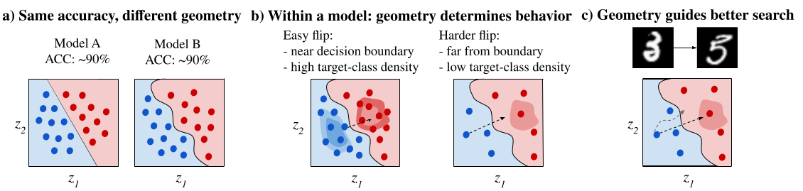

# A Geometric View of Counterfactual Behavior: Interaction of Boundary Proximity and Local Support

This repository contains the code for studying how counterfactual behavior depends on the interaction between decision-boundary proximity and local data support in learned representation spaces.
The project evaluates frozen pretrained encoders, linear classifier heads, and standardized local counterfactual search across vision, language, and multimodal settings. It also includes post hoc analyses and figure-generation utilities used for the paper.


Counterfactual behavior is shaped by boundary proximity and local support: given a representation, the code measures whether prediction-changing perturbations are reachable, how far they must move, and whether they terminate in target regions supported by nearby data.

---

## News

The repo is currently undergoing construction. Stay tuned for more updates!

---

## Features
- Train linear probes on top of frozen image, text, and multimodal encoders.
- Run standardized local counterfactual search in representation space.
- Measure boundary proximity, local support, counterfactual success, distance, and optimization effort.
- Retrain classifier heads on fixed embeddings to isolate boundary-placement effects.
- Cache embeddings for reproducible and efficient re-use across experiments.
- Generate paper-style figures and case-study payloads from saved experiment outputs.

---

## Supported Datasets & Encoders
- `mnist`, `shapes`, `chestxray`, `imdb`, `mmimdb`
- Vision: `resnet50`, `vit`, `dinov2`
- Text: `distilbert`, `bert`, `roberta`
- Multimodal: `clip`, `siglip2`

---

## Installation
- Requires Python `3.10+`

### Create and activate a virtual environment
```bash
python3.10 -m venv .venv
source .venv/bin/activate
```

### Install dependencies
```bash
pip install -r requirements.txt
```

### Optional environment variables
The code can also be configured through environment variables:

- `GEOMETRY_DATA_ROOT`: root directory for datasets
- `GEOMETRY_EMBEDDING_CACHE_DIR`: location for cached embeddings
- `GEOMETRY_HF_CACHE`: Hugging Face cache directory

If these are not set, defaults are taken from `src/core/utils.py`.

---

## Repository Layout
```text
geometry/
├── src/
│   ├── core/              # datasets, encoders, classifiers, geometry utilities
│   ├── counterfactuals/   # search, tuning, evaluation
│   ├── experiments/       # experiment runners
│   ├── analysis/          # post hoc analyses
│   └── figures/           # figure and case-study utilities
├── docs/
├── checkpoints/
├── outputs/
└── README.md
```

---

## MNIST Example Workflow
The MNIST pipeline is the simplest end-to-end example in this repository.

### Step 1: Train and evaluate one encoder
The command below runs the `mnist` + `vit` experiment, evaluates counterfactual behavior on the test split, saves cached embeddings, and stores the trained probe.

```bash
python -m src.experiments.unimodal_encoder_comparison \
  --dataset mnist \
  --encoder vit \
  --seed 42 \
  --probe-epochs 100 \
  --probe-lr 1e-3 \
  --probe-weight-decay 1e-4 \
  --eval-split test \
  --reference-split val \
  --k 20 \
  --step-size 1e-2 \
  --max-steps 500 \
  --trust-radius 1.0 \
  --save-probe-dir outputs/checkpoints \
  --output outputs/mnist_vit_encoder_comparison.json
```

This produces:
- cached embeddings for `train`, `val`, and `test`
- a probe checkpoint in `outputs/checkpoints/`
- an experiment JSON file in `outputs/`

### Step 2: Vary the classifier head under fixed embeddings
This reproduces the boundary-variation setting where the encoder stays fixed and only the linear head is retrained.

```bash
python -m src.experiments.unimodal_head_variation \
  --dataset mnist \
  --encoder vit \
  --probe-checkpoint outputs/checkpoints/mnist_vit_seed42_probe.pt \
  --seed 42 \
  --eval-split test \
  --reference-split val \
  --k 20 \
  --step-size 1e-2 \
  --max-steps 500 \
  --trust-radius 1.0 \
  --intervention-seed 43 \
  --intervention-seed 44 \
  --intervention-seed 45 \
  --intervention-seed 46 \
  --intervention-probe-weight-decay 1e-5 \
  --intervention-probe-weight-decay 1e-4 \
  --intervention-probe-weight-decay 1e-3 \
  --output outputs/interventions/mnist_vit_classifier_head_variation.json
```

This writes a JSON payload with:
- the baseline checkpoint result
- multiple retrained probe variants
- per-variant accuracy and counterfactual metrics
- raw example-level outputs

### Step 3: Run post hoc analysis
Run the combined analysis entry point:

```bash
python -m src.analysis.main \
  --compare-dir outputs \
  --cache-dir outputs/cache/embeddings \
  --interventions-dir outputs/interventions \
  --output-dir outputs/hypotheses \
  --test-fraction 0.2 \
  --split-seed 0 \
  --k 20 \
  --eval-split test \
  --svm-c 1.0
```

Or run individual analysis tasks:

- Geometry prediction
```bash
python -m src.analysis.main \
  --compare-dir outputs \
  --cache-dir outputs/cache/embeddings \
  --interventions-dir outputs/interventions \
  --output-dir outputs/hypotheses \
  --test-fraction 0.2 \
  --split-seed 0 \
  --task geometry
```

- Supported flips
```bash
python -m src.analysis.main \
  --compare-dir outputs \
  --cache-dir outputs/cache/embeddings \
  --interventions-dir outputs/interventions \
  --output-dir outputs/hypotheses \
  --k 20 \
  --task supported_flips
```

- SVM probe comparison
```bash
python -m src.analysis.main \
  --compare-dir outputs \
  --cache-dir outputs/cache/embeddings \
  --interventions-dir outputs/interventions \
  --output-dir outputs/hypotheses \
  --eval-split test \
  --svm-c 1.0 \
  --task svm_probe
```
