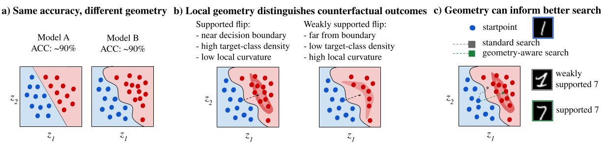

# Diagnosing Counterfactual Behavior through Local Representation Geometry

Models with similar predictive accuracy can behave differently under counterfactual search. This project studies how decision-boundary proximity, target-class support, and local curvature explain those differences and guide search toward supported alternatives. Experiments cover vision, medical imaging, text, multimodal data, and single-cell biology.



## Setup

Use Python 3.10+:

```bash
python3 -m venv .venv
source .venv/bin/activate
pip install -r requirements.txt
```

Data and pretrained checkpoints must be available for the selected experiment. Optional path settings are `GEOMETRY_DATA_ROOT`, `GEOMETRY_EMBEDDING_CACHE_DIR`, and `GEOMETRY_HF_CACHE`.

## Code layout

- `src/core/`: data loading, encoders, classifiers, and geometry.
- `src/counterfactuals/`: search and evaluation.
- `src/experiments/`: experiment runners.
- `src/analysis/`: comparisons and sensitivity analyses.
- `src/figures/`: result plots and qualitative examples.

More coming soon!